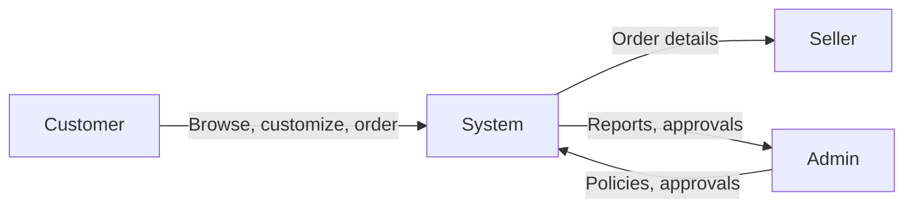
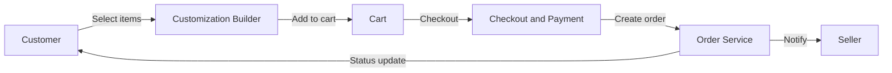
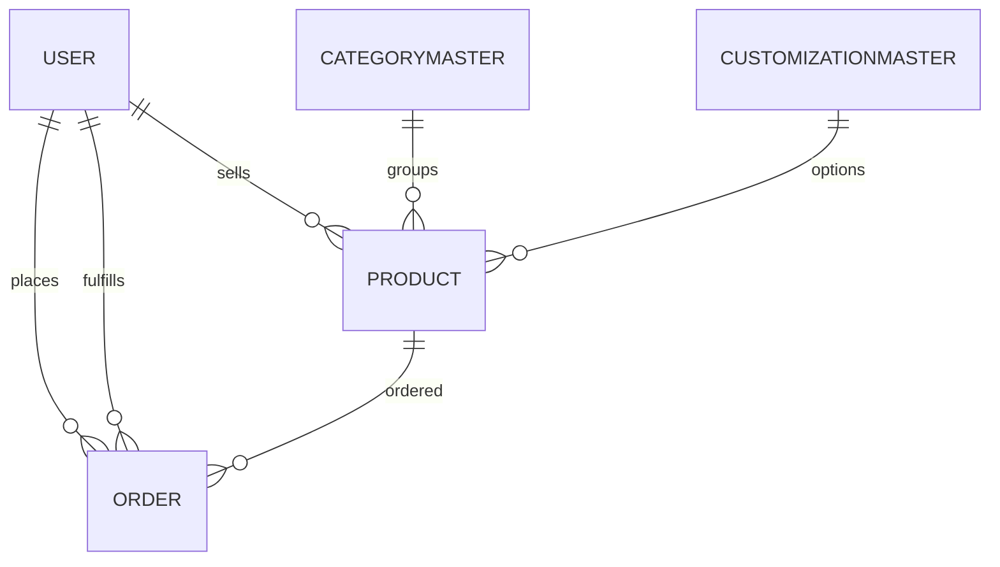

CraftzyGifts - Project Report (BCSP-064)

Student Name: [Fill]
Enrolment No: [Fill]
Regional Centre: [Fill]
Study Centre: [Fill]
Project Guide: [Fill]

1. Introduction
CraftzyGifts is a web-based multi-vendor marketplace for handmade gifts and custom hampers. Customers can purchase ready-made products or build personalized hampers. Sellers manage their products and orders, while admins approve sellers, manage categories, and monitor platform activity. The system is designed to demonstrate end-to-end software development following the SDLC.

2. Objectives
- Provide a marketplace for handmade gifts and curated hampers.
- Allow customers to customize hampers with add-ons and reference images.
- Enable sellers to manage listings and order fulfillment.
- Provide admin controls for approval, monitoring, and reporting.
- Deliver a responsive and user-friendly web experience.

3. Tools and Environment
Software:
- Node.js, npm
- MongoDB, Mongoose
- Express.js
- React.js, Vite
- Tailwind CSS
- VS Code, Chrome

Hardware (suggested):
- Processor: Intel i5 or equivalent
- RAM: 16 GB
- Storage: 238 GB or higher

4. Analysis Document (SRS)
4.1 Problem Statement
Provide an online platform where multiple sellers can list handmade gifts and customers can purchase or customize hampers, with admin oversight for quality and operations.

4.2 Stakeholders and User Classes
- Customer: Browse, customize, buy, and track orders.
- Seller: Create listings, manage inventory, and update order status.
- Admin: Approve sellers, manage categories, and monitor platform health.

4.3 Functional Requirements
- FR1: User registration and login with role-based access.
- FR2: Customers can browse products by category and seller.
- FR3: Customers can add items to cart and place orders.
- FR4: Customers can create customized hampers with add-ons and reference images.
- FR5: Sellers can add, edit, and remove product listings.
- FR6: Sellers can view and update order status.
- FR7: Admin can approve or reject sellers.
- FR8: Admin can manage categories and monitor products.
- FR9: Admin can view reports for orders, sellers, and analytics.
- FR10: Users can manage profile and addresses.

4.4 Non-Functional Requirements
- Security: Password hashing and JWT authentication.
- Performance: Fast browsing and responsive UI for mobile and desktop.
- Reliability: Data consistency using MongoDB and validations.
- Usability: Clear navigation and simple checkout.
- Maintainability: Modular code in client and server layers.

4.5 Data Flow Diagram (Level 0)


4.6 Data Flow Diagram (Level 1)
```mermaid
flowchart LR
  subgraph Customer Module
    C1[Register and Login]
    C2[Browse Products]
    C3[Customize Hamper]
    C4[Cart and Checkout]
    C5[View Orders]
  end
  subgraph Seller Module
    S1[Manage Products]
    S2[Manage Orders]
    S3[Update Status]
  end
  subgraph Admin Module
    A1[Approve Sellers]
    A2[Manage Categories]
    A3[Monitor Products and Orders]
    A4[Analytics and Settings]
  end
  Customer Module --> System[(CraftzyGifts Platform)]
  Seller Module --> System
  Admin Module --> System
```

4.7 Data Flow Diagram (Level 2 - Order and Custom Hamper Flow)


4.8 ER Diagram (High Level)


4.9 Data Dictionary (Summary)
User
| Field | Type | Description |
| --- | --- | --- |
| name | String | Full name |
| email | String | Unique login email |
| password | String | Hashed password |
| role | String | customer, seller, admin |
| sellerStatus | String | pending, approved, rejected |
| storeName | String | Seller store name |
| phone | String | Contact number |
| profileImage | String | Profile image URL |
| addresses | Object | Shipping and billing addresses |

Product
| Field | Type | Description |
| --- | --- | --- |
| name | String | Product name |
| description | String | Product details |
| price | Number | Selling price |
| stock | Number | Inventory count |
| category | String | Category label |
| images | [String] | Image URLs |
| seller | ObjectId | Reference to User |
| isCustomizable | Boolean | Customizable or not |
| customizationCatalog | Array | Customizable items |
| makingCharge | Number | Additional charge |

Order
| Field | Type | Description |
| --- | --- | --- |
| customer | ObjectId | Buyer |
| seller | ObjectId | Seller |
| product | ObjectId | Product reference |
| quantity | Number | Quantity ordered |
| price | Number | Unit price |
| makingCharge | Number | Customization charge |
| total | Number | Total order amount |
| status | String | Order state |
| paymentStatus | String | Payment state |
| customization | Object | Reference image, notes, selections |
| shippingAddress | Object | Delivery address |

PlatformSettings
| Field | Type | Description |
| --- | --- | --- |
| platformName | String | Platform title |
| currencyCode | String | Currency code |
| lowStockThreshold | Number | Low stock limit |
| autoApproveSellers | Boolean | Seller auto approval |

Additional Collections
- CategoryMaster: category groups and subcategories.
- CustomizationMaster: reusable customization options.
- Notification: seller notifications.
- ContactRequest: customer to seller messages.

5. Design Document
5.1 Modularization
- Authentication module: register, login, JWT validation.
- Customer module: browse, cart, checkout, orders.
- Seller module: product CRUD, order updates.
- Admin module: approvals, categories, analytics, settings.
- Customization module: selections, reference images, pricing.

5.2 Data Integrity and Constraints
- Unique email for users.
- Enumerations for roles, seller status, order status.
- Required fields for core entities (user, product, order).
- Validation for stock and price to be non-negative.

5.3 Procedural Design (Key Flows)
- Login flow: validate credentials -> issue JWT -> set user context.
- Product listing flow: seller submits product -> stored in MongoDB.
- Order flow: cart -> checkout -> order creation -> seller notification.
- Custom hamper flow: select items -> compute making charge -> submit order.

5.4 User Interface Design
Customer screens:
- Home, Products, Product Detail, Customization, Cart, Checkout, Orders.
Seller screens:
- Dashboard, Products, Listed Items, Orders, Payments, Settings.
Admin screens:
- Dashboard, Sellers, Products, Categories, Orders, Reports, Analytics, Settings.

6. Program Code
Implementation follows a client-server architecture.
- Frontend: `client/src/` contains pages, components, and utilities.
- Backend: `server/` contains Express routes, controllers, and Mongoose models.
- API base URL: `http://localhost:5000/api`.

7. Testing
Test Cases (Manual)
| ID | Scenario | Expected Result | Status |
| --- | --- | --- | --- |
| TC01 | Register new customer | Account created | Pass |
| TC02 | Login with valid credentials | JWT issued | Pass |
| TC03 | Add product to cart | Item appears in cart | Pass |
| TC04 | Place order | Order created with status placed | Pass |
| TC05 | Seller updates order status | Status visible to customer | Pass |
| TC06 | Admin approves seller | Seller status approved | Pass |

8. Input and Output Screens
Input screens:
- Register, Login, Profile, Manage Addresses, Add Product, Customization.
Output screens:
- Product listings, Order history, Seller order list, Admin reports.

9. Security Implementation
- Passwords stored as hashes using bcrypt.
- JWT-based authentication with role-based authorization.
- Request body size limits to prevent oversized uploads.
- Protected routes for seller and admin dashboards.

10. Limitations
- Payment gateway is mock and not integrated with live providers.
- No automated email or SMS notifications.
- Limited analytics and reporting depth for large-scale usage.

11. Future Applications
- Mobile apps and multi-language support.
- AI-based recommendations and AR previews.
- Subscription services and corporate gifting workflows.
- Logistics and payment gateway integrations.

12. Bibliography
- React Documentation
- Node.js Documentation
- Express.js Documentation
- MongoDB Documentation
- Mongoose Documentation
- JSON Web Token (JWT) Documentation

Appendix A - Project Proposal Proforma
Attach the approved proforma with signatures and dates.

Appendix B - Project Synopsis
Attach the signed synopsis.

Appendix C - Guide Bio-data
Attach the guide bio-data with signature and date.

Appendix D - Certificate of Originality (Template)
This is to certify that the project report entitled __________________________
submitted to Indira Gandhi National Open University in partial fulfilment of the requirements
for the award of the degree of Bachelor of Computer Applications (BCA), is an original work
carried out by Mr./Ms. __________________________, Enrolment No. __________, under the
guidance of Mr./Ms. __________________________.

The matter embodied in this project is a genuine work done by the student and has not been
submitted to any other university or institute for the fulfilment of any course of study.

Signature of Student: ____________________  Date: __________
Signature of Guide: ______________________  Date: __________
