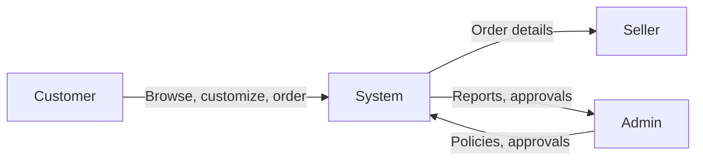
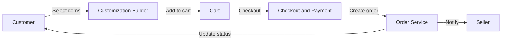
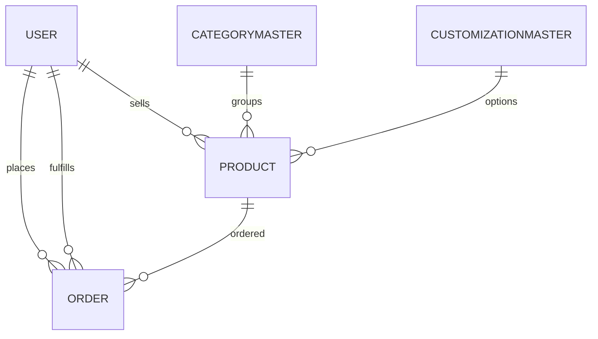

CraftzyGifts - Project Synopsis (BCSP-064)

Project Title
CraftzyGifts - An Online Gifts and Custom Hamper System

1. Introduction and Objectives
Introduction:
CraftzyGifts is a web-based multi-vendor marketplace for handmade gifts, curated hampers, and custom gifting. Customers can purchase ready-made hampers or build personalized gift boxes. Sellers manage their own product listings and orders. The admin panel provides approval, moderation, and monitoring.

Objectives:
- Allow customers to buy ready-made products or build fully customized hampers.
- Provide home-based crafters an easy platform to sell handmade products.
- Include making and decoration charges for custom hampers.
- Enable reference image upload to guide sellers in designing hampers.
- Provide admin control for monitoring sellers, products, and orders.
- Deliver a responsive, user-friendly web application for seamless browsing and ordering.

2. Project Category
- Category: Web-based multi-vendor e-commerce system with database management.
- Technologies: MERN stack (MongoDB, Express.js, React.js, Node.js).

3. Analysis
3.1 DFD Level 0


3.2 DFD Level 1
```mermaid
flowchart LR
  subgraph Customer Module
    C1[Register and Login]
    C2[Browse Products]
    C3[Customize Hamper]
    C4[Cart and Checkout]
    C5[View Orders]
  end
  subgraph Seller Module
    S1[Manage Products]
    S2[Manage Orders]
    S3[Update Status]
  end
  subgraph Admin Module
    A1[Approve Sellers]
    A2[Manage Categories]
    A3[Monitor Products and Orders]
    A4[Analytics and Settings]
  end
  Customer Module --> System[(CraftzyGifts Platform)]
  Seller Module --> System
  Admin Module --> System
```

3.3 DFD Level 2 (Order and Custom Hamper Flow)


3.4 ER Diagram (High Level)


3.5 Database Design Summary
- User stores customer, seller, and admin accounts with role-based access.
- Product stores listing data, pricing, images, and customization options.
- Order stores purchase, payment, and delivery status.
- CategoryMaster and CustomizationMaster store shared metadata.
- PlatformSettings stores global configuration.

4. Project Structure
Modules:
- Authentication module: registration, login, JWT-based access.
- Admin module: seller approvals, category management, platform settings.
- Seller module: product CRUD, order status updates.
- Customer module: browsing, cart, checkout, order tracking.
- Custom hamper module: selection of items, reference images, and making charges.

Data Structures:
- Cart items stored in client-side arrays and persisted in local storage.
- Customization selections stored as lists and key-value maps.
- MongoDB collections for persistent storage.

Process Logic:
- Customer registration and login -> browse or customize -> add to cart -> checkout -> order created.
- Seller updates product inventory and order status.
- Admin reviews sellers and monitors orders and products.

Testing Details:
- Unit testing for modules such as login, add product, cart operations.
- Integration testing for customer -> order -> seller -> admin workflow.

Reports Generation:
- Admin reports for sellers, products, orders, and analytics.
- Seller reports for orders received and earnings.
- Customer order history and customization details.

5. Tools / Platform / Hardware / Software Requirements
Software:
- Node.js, npm, MongoDB, React.js, Express.js, VS Code.
Hardware:
- Processor: Intel i5 or equivalent.
- RAM: 16 GB.
- Storage: 238 GB or higher.
Platform:
- Web-based system, responsive across desktop and mobile.

6. Industry / Client Details
This project is developed as an academic project. It can be adapted for small-scale craft businesses or local gift shops.

7. Future Scope and Enhancements
- Mobile apps, international shipping, and multi-language support.
- AI-based recommendations and AR previews for customized hampers.
- Subscription services, advanced seller analytics, and marketing tools.
- AI chatbots, blockchain authenticity, and social integrations.
